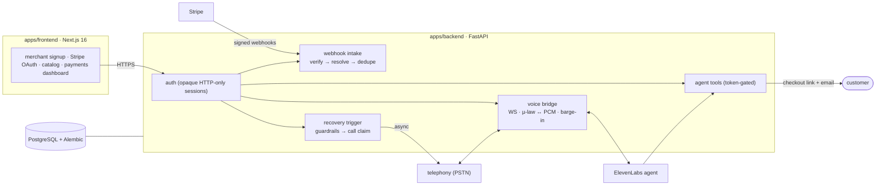

# Voic — AI voice agent that wins back failed payments

[](#why-this-exists)
[](#tech-stack)
[](#tech-stack)
[](#the-recovery-loop)

> Detect revenue at risk → call the customer → diagnose → recover the money — one bounded, audited loop.

## Why this exists

A customer picks the product, enters their card details — and the payment fails. A bank timeout, a daily limit, a late OTP. The intent was 100% there; the money never moved.

What happens next, for almost every merchant:

- **Silence** — the merchant never knows; the customer buys elsewhere.
- **Email blast** — hours later, a generic "your payment failed" email lands in spam. No trust, no click.
- **Support ticket** — by the time a human replies, the impulse is long dead.

The uncomfortable truth: **failed payments are usually the highest-intent customers a merchant has.** They already said yes — the only thing missing was a second chance, delivered while that intent is still alive. Voic flips the model from *reactive email* to *proactive conversation*.

## The recovery loop

The moment a payment flips to `FAILED`, Voic places a real phone call — not a robocall, a conversation:

1. **Seconds after the failure**, the verified provider webhook tells Voic the payment died. Guardrails check it's a valid recovery case (customer has a phone, hasn't been called yet).
2. **The customer's phone rings.** The AI agent greets them naturally — and already knows exactly which charge this is about: *"Hi, you tried paying ₹1,499 at 7:42 pm and it didn't go through — did you still want the item?"*
3. **The agent diagnoses.** "My card got blocked", "I didn't recognize this charge" — objections are answered live, which a dead email can never do.
4. **The agent recovers, right there.** It mints a fresh hosted checkout link for that exact product and amount — and emails it while they're still on the call.
5. **The customer pays on their own terms.** The success webhook flows back and Voic marks the case recovered.
6. **The call closes.** Conversation ID, timestamps, and outcome are persisted as an audit trail.

## Architecture

A two-app monorepo with a strict boundary: the browser never touches secrets, the webhook never blocks on calls, and the agent never touches payments without going through a gated tool.



Four layers, each with one job:

| Layer | Responsibility |
|---|---|
| **Merchant surface** (frontend) | Signup, Stripe Standard OAuth connect, catalog, live payments dashboard. The browser only ever holds an opaque session cookie. |
| **Truth layer** (webhook intake) | Signature-verified raw body, account resolved from the provider's signed field, immutable events with `(provider, event_id)` dedupe. Duplicates and out-of-order events are first-class test cases. |
| **Decision layer** (recovery trigger) | Verified failure + phone present + no prior call → the webhook returns 2xx immediately and the call is enqueued in the background. |
| **Conversation layer** (voice + agent) | Bidirectional WebSocket bridges PSTN audio (8 kHz µ-law) to ElevenLabs (16 kHz PCM), with a bounded playback queue and local barge-in. |

## The agent's agency is deliberately narrow

Every money action goes through a token-authenticated tool API (`POST /api/agent/tools/*`, gated by `X-Agent-Token`):

| Tool | What it does | Bounded because |
|---|---|---|
| `get-payment-status` | Reads the failed payment's amount, currency, status, customer contact | Read-only, scoped to the bound payment |
| `create-checkout-link` | Reuses the merchant's own Stripe price to mint a hosted Payment Link | Never manufactures URLs; provider-scoped, price-validated |
| `send-email` | Sends the checkout link via Resend (falls back to a logged `demo: true` response) | Destination defaults to the payment's own customer |

Hard stopping rules the agent cannot break, no matter what the caller says:

- **One call per payment** — dedupe is enforced by a persisted `CallAttempt` claim; repeat webhooks never ring-spam.
- **Success wins** — any later `COMPLETED` event closes the open call job; the agent never calls someone who already paid.
- **Phone required** — no verified customer phone on the event → no call, ever.
- **Signed context** — answer URLs and media sockets are HMAC-bound to `payment_id` + `call_id`; tampered or replayed URLs are rejected before any audio flows.
- **Graceful degradation at every link** — no telephony creds → skipped; no ElevenLabs → scripted `<Speak>` fallback. The webhook always returns 2xx: a recovery system must never make the payment path worse.

Every call attempt, provider ID, conversation ID, and close timestamp is persisted on `CallAttempt` — the audit trail can be queried, not just watched.

## Tech stack

| Layer | Choices |
|---|---|
| Frontend | Next.js 16 (App Router), React 19, TypeScript, Tailwind CSS 4, TanStack Table, Recharts |
| Backend | Python 3.12, FastAPI, Pydantic, SQLAlchemy 2, PostgreSQL, Alembic |
| Payments | Stripe (Standard OAuth, PaymentIntents, Payment Links, webhooks) behind a provider abstraction |
| Voice | Vobiz (Plivo-compatible) PSTN + bidirectional media WebSocket, µ-law ↔ PCM transcoding (stdlib `audioop`) |
| AI | ElevenLabs Conversational AI agent with dynamic variables and three webhook tools |
| Email | Resend |
| Infra | `make dev` runs both apps; FastAPI `BackgroundTasks` for recovery jobs; 11 Alembic migrations |

## Quickstart

```bash
git clone https://github.com/Vighnesh-V-H/voic.git && cd voic

make install          # backend venv + frontend npm deps
make migrate          # alembic upgrade head (needs PostgreSQL)
make dev              # FastAPI :8000 + Next.js together
```

Wire your `.env` (see `apps/backend/.env.example`): `DATABASE_URL`, `STRIPE_SECRET_KEY`, `STRIPE_CONNECT_WEBHOOK_SECRET`, plus the voice block (`VOBIZ_*`, `ELEVENLABS_*`, `AGENT_TOOL_TOKEN`, `VOICE_CALLBACK_TOKEN`). Empty voice credentials = voice path logs-and-skips; the rest of the product works without them.

Verify everything:

```bash
make verify   # pytest + eslint + next build + offline migration SQL
```

## Running the demo

The full happy path — failed payment → phone rings → agent talks → checkout link lands in the inbox — is a 10-step checklist in [`docs/voice-demo-runbook.md`](docs/voice-demo-runbook.md). Short version:

1. Sign up and connect a Stripe Test Mode account via Standard OAuth.
2. Create a payment, then trigger a failure (replay `payment_intent.payment_failed` or use the built-in demo trigger).
3. The telephony provider dials the customer; the WebSocket bridge hands audio to the AI agent.
4. The agent greets with the payment's real amount, answers questions, and mints a checkout link on request — emailed before the call ends.
5. Hang up → `CallAttempt` closes with timestamps and the conversation ID retained.

## Test surface

11 pytest suites exercise the API boundary, including:

- OAuth state expiry, single-use, and callback handling — no credential leakage
- Webhook signature verification on the raw body; malformed payloads; unknown accounts
- Duplicate-event idempotency and out-of-order persistence
- Cross-merchant access rejection — *metadata can never select a merchant*
- Call trigger guardrails: phone required, one call per payment, success closes the call
- WebSocket relay with a simulated telephony client against the real bridge

## Where this goes next

The trigger rule today is `Payment.status → FAILED`. The architecture is already designed to widen, in dependency order:

- **Widen triggers** — `checkout.session.expired` (abandonment) and `invoice.payment_failed` (failed renewals) map to the same `FAILED` transition.
- **Post-call outcomes** — hangup classification (recovered / promise-to-pay / refused) written back to `CallAttempt.outcome`.
- **Retry sequencers** — bounded call/email cadences with quiet hours and per-merchant frequency caps.
- **Measured money recovered** — batch-level recovered-₹ reporting built on the existing payment-event store.

## Docs

- [`docs/architecture.md`](docs/architecture.md) — full Phase-1 + voice architecture
- [`docs/voice-mvp-contracts.md`](docs/voice-mvp-contracts.md) — frozen voice contracts (WS, tools, DB, env)
- [`docs/voice-vobiz-ws.md`](docs/voice-vobiz-ws.md) — telephony stream protocol notes
- [`docs/adr/`](docs/adr/) — architecture decision records
- [`CONTEXT.md`](CONTEXT.md) — domain language
